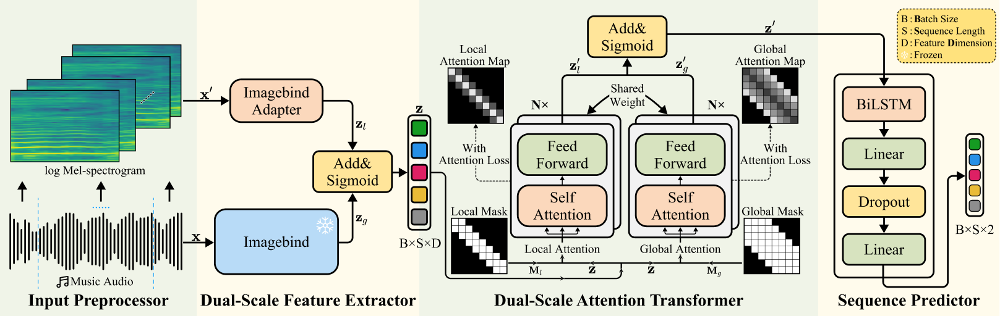

# Personalized Dynamic Music Emotion Recognition with Dual-Scale Attention-Based Meta-Learning (DSAML)
<p align="center">
    <a href="https://github.com/Littleor/Personalized-DMER/blob/main/LICENSE" target="blank">
    
    </a>
    <a href="https://github.com/Littleor/Personalized-DMER/fork" target="blank">
    
    </a>
    <a href="https://github.com/Littleor/Personalized-DMER/stargazers" target="blank">
    
    </a>
    <a href="https://github.com/Littleor/Personalized-DMER/issues" target="blank">
    
    </a>
    <a href="https://github.com/Littleor/Personalized-DMER/pulls" target="blank">
    
    </a>
</p>

[[Project Website](https://littleor.github.io/PDMER/)] | [[Paper](https://arxiv.org/abs/2412.19200)]



Here is the core implementation of the DSAML model in the paper "Personalized Dynamic Music Emotion Recognition with Dual-Scale Attention-Based Meta-Learning", which is accepted by the AAAI 25.

## Get Start

### Prerequisites

* Python >= 3.8.5, < 3.9
* PyTorch >= 2.2.1

### Installation

```bash
conda env create -f environment.yml
pip install -r requirements.txt
```

### Dataset Download
We need to download the [DEAM](https://cvml.unige.ch/databases/DEAM/) dataset and unzip both the audio and annotation files. 
Specifically, you need create `DEAM_Annotations` and `DEAM_audio` folders in the root directory of the dataset root folder, and put the annotation and audio files in the corresponding folders. The final file structure should be like this:

```txt
DEAM
├── DEAM_Annotations
│   ├── annotations
├── DEAM_audio
│   ├── MEMD_audio
└── features (This is Optional)
    └── features
```

Then we need to preprocess the dataset, but before we do that, we need to create the `.env` file.

### Environment Variables

After downloading the dataset, you need to create a `.env` file in the root directory of the project. The `.env` file should contain the following environment variables:

```env
# The directory to save the logs
LOG_DIR="./logs"    

# The directory to save the audio embedding for DEAM dataset
AUDIO_EMBEDDING_DIR_NAME="feature_embedding"    
# The path to the DEAM dataset
DATASET_PATH="/your/path/to/DEAM"    

# The key to the audio input in the dataset, please keep this
AUDIO_INPUT_KEY="log_mel_spectrogram"
```

You should modify the `DATASET_PATH` and `PMEMO_DATASET_PATH` to the path where you store the DEAM and PMEmo dataset.

### Dataset Preprocessing

In order to speed up the training process, we need to preprocess the dataset. You can run the following command to preprocess the dataset:

```bash
./scripts/dataset.sh
# If you want to use specific GPU, you can add the following command
# CUDA_VISIBLE_DEVICES=1 ./scripts/dataset.sh
```

This process will take about one hour, depending on your machine.

### Train
After the dataset is preprocessed, you can train the model by running the following command:

```bash
# For DMER Task
python train.py --device "cuda:0" --not_using_maml
# For PDMER Task
python train.py --device "cuda:0" --using_personalized_data_train --using_personalized_data_validate
```

## Citation

If you find this code useful in your research, please consider citing:

```bibtex
@misc{zhang2024personalizeddynamicmusicemotion,
      title={Personalized Dynamic Music Emotion Recognition with Dual-Scale Attention-Based Meta-Learning}, 
      author={Dengming Zhang and Weitao You and Ziheng Liu and Lingyun Sun and Pei Chen},
      year={2024},
      eprint={2412.19200},
      archivePrefix={arXiv},
      primaryClass={cs.SD},
      url={https://arxiv.org/abs/2412.19200}, 
}
```
